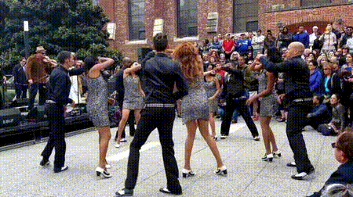
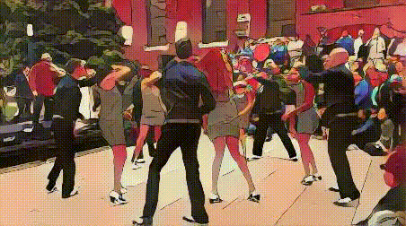
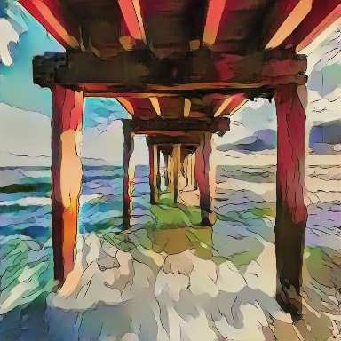
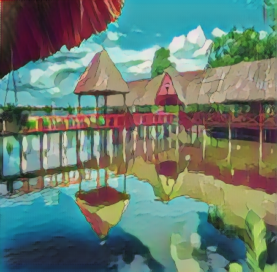
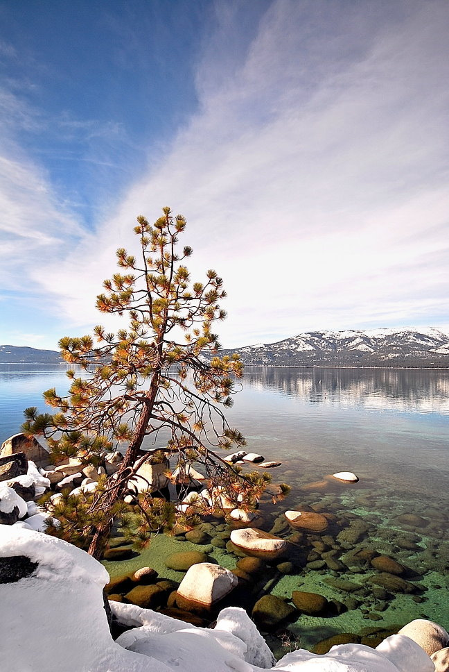
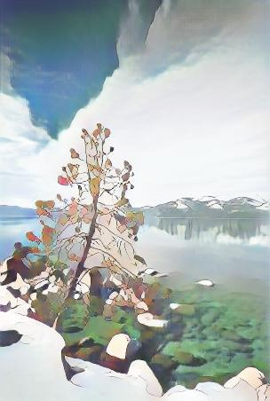
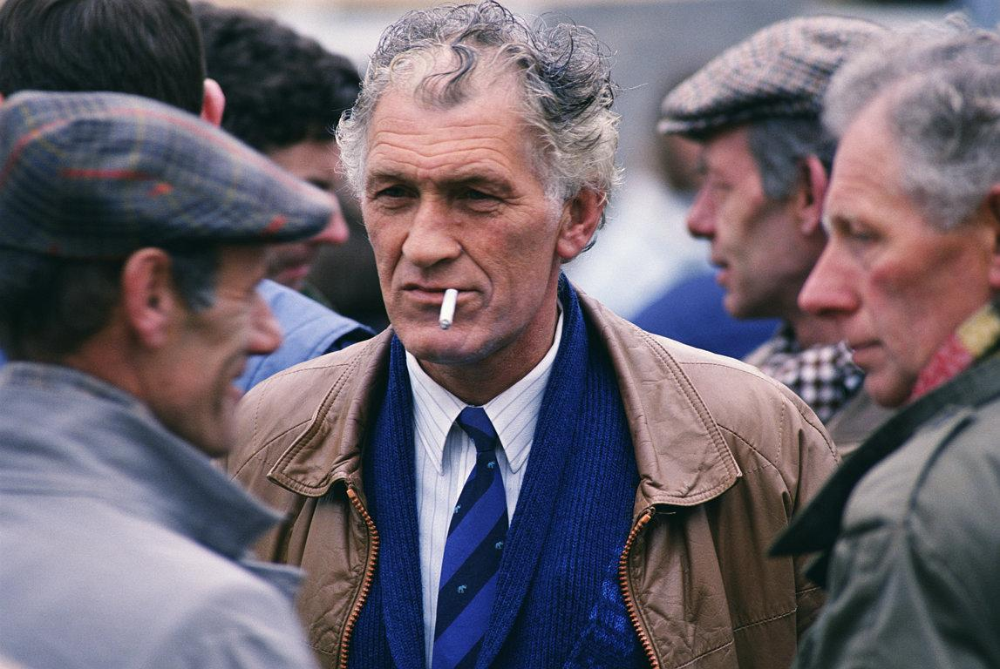
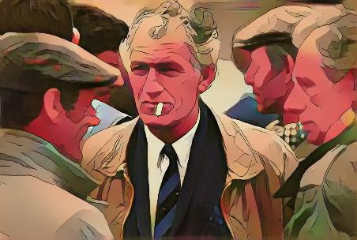
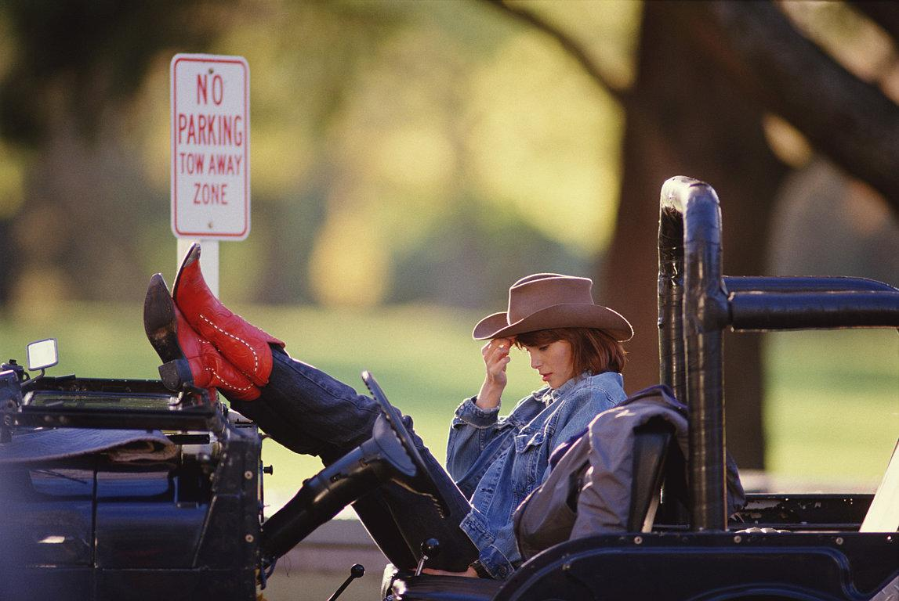
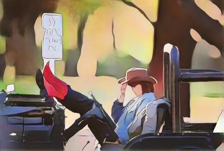

# CartoonGAN-Test-Pytorch-Torch
Pytorch and Torch testing code of [CartoonGAN](http://openaccess.thecvf.com/content_cvpr_2018/CameraReady/2205.pdf) `[Chen et al., CVPR18]`. With the released pretrained [models](http://cg.cs.tsinghua.edu.cn/people/~Yongjin/Yongjin.htm) by the authors, I made these simple scripts for a quick test.

<p>
    
    
</p>


## Getting started

- Linux
- NVIDIA GPU
- Pytorch 0.3
- Torch

```
git clone https://github.com/Yijunmaverick/CartoonGAN-Test-Pytorch-Torch
cd CartoonGAN-Test-Pytorch-Torch
```

## Pytorch

The original pretrained models are Torch `nngraph` models, which cannot be loaded in Pytorch through `load_lua`. So I manually copy the weights (bias) layer by layer and convert them to `.pth` models. 

- Download the converted models:

```
sh pretrained_model/download_pth.sh
```

- For testing:

```
python test.py --input_dir YourImgDir --style Hosoda --gpu 0
```

## Torch

Working with the original models in Torch is also fine. I just convert the weights (bias) in their models from CudaTensor to FloatTensor so that `cudnn` is not required for loading models.

- Download the converted models:

```
sh pretrained_model/download_t7.sh
```

- For testing:

```
th test.lua -input_dir YourImgDir -style Hosoda -gpu 0
```

## Examples (Left: input, Right: output)

<p>
    
    
</p>

<p>
    
    
</p>

<p>
    
    
</p>

<p>
    
    
</p>

<p>
    
    
</p>


## Note

- The training code should be similar to the popular GAN-based image-translation frameworks and thus is not included here.

## Acknowledgement

- Many thanks to the authors for this cool work.

- Part of the codes are borrowed from [DCGAN](https://github.com/soumith/dcgan.torch), [TextureNet](https://github.com/DmitryUlyanov/texture_nets), [AdaIN](https://github.com/xunhuang1995/AdaIN-style) and [CycleGAN](https://github.com/junyanz/pytorch-CycleGAN-and-pix2pix).

